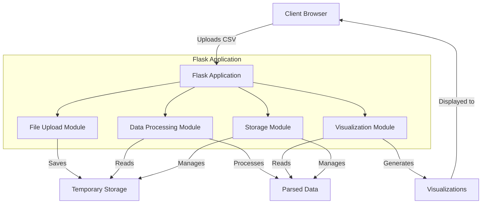
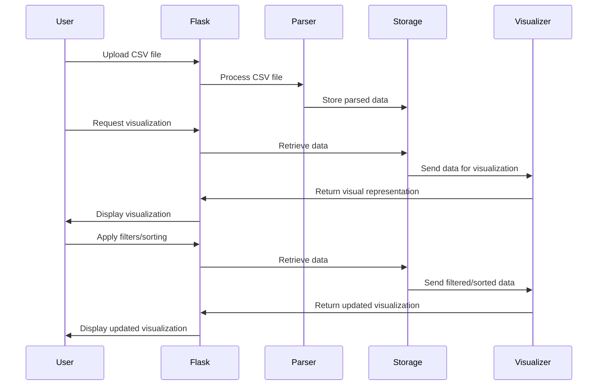

# TODO: Flask CSV Parser and Visualizer

This document outlines the implementation strategy for building a Flask application that can parse and visualize CSV data.

## Architecture Diagram



## Data Flow Diagram



## Implementation Steps

### Phase 1: Project Setup

1. [ ] Create the basic project structure
   - app directory
   - templates directory
   - static directory
   - config.py
   - run.py

2. [ ] Set up the Flask application
   - Create __init__.py for app initialization
   - Configure app settings
   - Set up error handlers

3. [ ] Create base templates
   - Create base.html with common layout
   - Create navigation elements

### Phase 2: File Upload Functionality

4. [ ] Create file upload form
   - Design HTML form with file input
   - Add validation for CSV files

5. [ ] Implement file upload route
   - Create route to handle file upload
   - Validate file type and size
   - Save uploaded file to temporary location

6. [ ] Implement CSV parsing service
   - Create parser.py with CSV parsing functions
   - Support different delimiters
   - Handle parsing errors

### Phase 3: Data Storage

7. [ ] Implement data storage mechanism
   - Create storage.py for managing parsed data
   - Use session storage for user data
   - Implement data cleanup functionality

8. [ ] Create data model
   - Define CSV data structure
   - Implement methods for data access

### Phase 4: Basic Visualization

9. [ ] Implement data table visualization
   - Create route for displaying data as a table
   - Design table template with Jinja2
   - Add styling for the table

10. [ ] Add pagination for large datasets
    - Implement pagination logic
    - Add UI elements for page navigation

11. [ ] Implement column selection
    - Add UI for selecting columns to display
    - Update visualization based on selection

### Phase 5: Advanced Features

12. [ ] Implement data filtering
    - Create UI for entering filter criteria
    - Apply filters to the dataset
    - Update visualization with filtered data

13. [ ] Implement data sorting
    - Add sorting buttons to column headers
    - Apply sorting to the dataset
    - Update visualization with sorted data

14. [ ] Implement chart visualization
    - Integrate a charting library
    - Create basic chart types (bar, line, pie)
    - Add UI for selecting chart type

### Phase 6: Enhancements

15. [ ] Add download functionality
    - Add option to download filtered/processed data
    - Implement download route

16. [ ] Implement data statistics
    - Add summary statistics for numerical columns
    - Display statistics in the UI

17. [ ] Add error handling and user feedback
    - Improve error messages
    - Add success notifications

### Phase 7: Testing and Refinement

18. [ ] Write tests for key functionality
    - Test file upload
    - Test parsing with different delimiters
    - Test visualization features

19. [ ] Conduct user testing
    - Gather feedback
    - Make refinements based on feedback

20. [ ] Document the application
    - Update README with usage instructions
    - Add comments to code
    - Create user guide
```

## Getting Started

To begin implementation, follow these steps:

1. Start with Phase 1: Project Setup
2. Work through each phase step by step
3. Test functionality after completing each step
4. Refine your implementation as needed

Remember, this is an iterative process. Feel free to adjust the steps and priorities as you progress.
